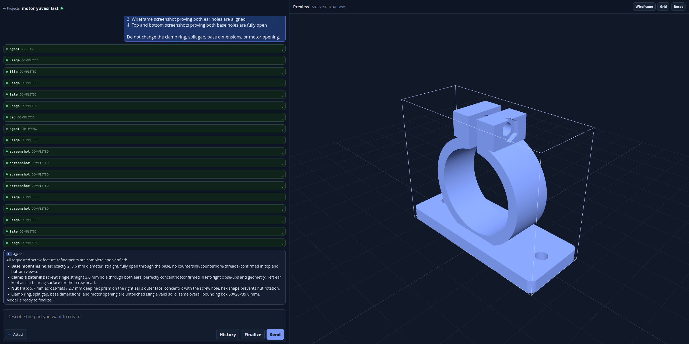

# 🏗️ Local AI CAD Agent

[](LICENSE)
[](https://www.python.org/)

A local-first web app that lets you **chat with an AI agent to create parametric CAD models**. Built with [build123d](https://github.com/gumyr/build123d) for solid modeling, [Three.js](https://threejs.org/) for in-browser preview, and [OpenRouter](https://openrouter.ai/) for LLM access — all sandboxed with Bubblewrap.

> **⚠️ Status:** This project is in **early development** and is also a **hobby project**. It is currently best suited for **simple, non-complex mechanical parts**. It may not yet be a good fit for finely detailed, large, or intricate models.

<p align="center">
  
</p>

## ✨ Features

- **Chat-driven modeling** — Describe what you want in natural language; the agent writes and runs build123d Python code
- **Live reasoning** — Watch the model's thinking stream in real-time while it works
- **STL preview** — Rotate, pan, and inspect generated models directly in the browser
- **Reference images** — Upload up to 5 images (10 MB each) to guide the agent
- **Sandboxed execution** — All generated code runs in a Bubblewrap container with blocked network and resource limits
- **Verified builds** — Each model is built, checked for a valid solid, and rendered before the agent reports completion
- **Project management** — Create, rename, and switch between multiple CAD projects with persisted conversation history
- **Model history** — Inspect source diffs, track successful builds, and restore any retained `model.py` revision
- **Reusable experience memory** — The agent records verified, non-sensitive CAD fixes for reuse across projects in the same workspace
- **Dark theme UI** — Compact, responsive interface with Markdown rendering and syntax highlighting

## 📋 Requirements

- **Python** 3.10+
- **Linux** with `bubblewrap` and `libseccomp2`
- An API key for either [OpenRouter](https://openrouter.ai/keys) or [OpenAI](https://platform.openai.com/api-keys)

## 🚀 Quick Start

```bash
# Clone and install dependencies
git clone https://github.com/neuronaline/local-ai-cad-agent.git
cd local-ai-cad-agent
./install.sh

# Add the key for your selected LLM provider to .env, e.g.
# OPENROUTER_API_KEY=your-key

# Run
./run.sh
```

Open `http://127.0.0.1:5000` (or whatever `server.host`/`server.port` you configured).

The default provider is OpenRouter. To use OpenAI directly, set
`llm.provider: openai` in `config.yaml` and set `OPENAI_API_KEY` in `.env`.
Only the key for the selected provider is required.

## 🧭 Using the app

1. Create a project. Project names use lowercase letters, numbers, and hyphens.
2. Describe the part, its dimensions, and its intended function. Attach up to five
   PNG, JPEG, or WebP reference images if useful.
3. Answer any material design questions the agent asks. It then writes `model.py`,
   builds it in the sandbox, and displays the resulting STL and render.
4. Review the model and continue the conversation to refine it. Use the revision
   list to compare source changes or restore a previous version.

Reference images are limited to 10 MB each and are normalized to PNG before being
sent to the selected LLM provider. A successful build creates a local `preview.stl`
and `render.png`; `model.py` remains the editable parametric source. Exporting
additional formats is not currently provided by the UI.

## 📁 Project Structure

```
local-ai-cad-agent/
├── app.py                     # Flask HTTP/SSE server
├── agent/
│   ├── core.py                # AgentRunner tool-calling loop
│   ├── openrouter.py          # Streaming chat-completions client
│   ├── openai_client.py        # Direct OpenAI chat-completions client
│   ├── revisions.py           # Immutable model revisions, builds & rollback
│   ├── sandbox.py             # Bubblewrap workspace isolation
│   ├── settings.py            # Configuration loading & Settings dataclass
│   ├── prompt.py              # System prompt with build123d playbook
│   ├── tool_schemas.py        # Operation-specific model tool contracts
│   ├── tool_results.py        # Structured success and error envelopes
│   ├── images.py              # Reference image normalization
│   └── tools/                 # Agent tools (file, terminal, cad, question, experience)
├── static/
│   ├── js/app.js              # SSE client, chat & UI logic
│   ├── js/viewer.js           # Three.js CadViewer
│   └── css/style.css          # Dark theme
│   └── vendor/                # Pinned, local frontend dependencies
├── templates/
│   ├── index.html             # Chat + 3D viewer page
│   └── projects.html          # Project management page
├── tests/                     # Unit, API, sandbox & real-CAD acceptance tests
├── run.sh                     # Startup script
├── gunicorn.conf.py           # Single-worker WSGI config
├── config.example.yaml        # Shareable defaults
└── requirements.txt
```

## ⚙️ Configuration

Copy `config.example.yaml` to `config.yaml` (git-ignored) and edit it for this
machine. The application reads this project-local file; it does not load a
per-user configuration file.

| Key | Default | Description |
|---|---|---|
| `workspace_root` | `~/CAD-Agent-Projects` | Where project data lives |
| `llm.provider` | `openrouter` | Active provider: `openrouter` or `openai` |
| `agent.tool_call_limit` | `30` | Max tool rounds per task |
| `agent.revision_retention_count` | `0` | Model revisions to retain (`0` keeps all) |
| `agent.debug_log_tool_errors` | `false` | Write detailed recoverable tool failures to `<project>/debug-errors.jsonl` |
| `openrouter.model` | `google/gemini-3.6-flash` | OpenRouter model slug |
| `openrouter.timeout_seconds` | `60` | Request timeout for OpenRouter |
| `openrouter.reasoning_effort` | `medium` | `minimal`, `low`, `medium`, or `high` |
| `openrouter.provider` | `google-vertex/global` | Preferred provider slug |
| `openrouter.force_provider` | `true` | Disable provider fallbacks |
| `openai.model` | `gpt-5.6-terra` | Direct OpenAI model slug |
| `openai.timeout_seconds` | `60` | Request timeout for OpenAI |
| `openai.reasoning_effort` | *(empty)* | Optional reasoning setting for compatible OpenAI models |
| `server.host` / `server.port` | `127.0.0.1` / `5000` | Bind address |
| `ui.show_info_messages` | `true` | Show tool-status info messages in chat |

`reasoning_effort` must be one of `minimal`, `low`, `medium`, or `high` when it
is set. YAML booleans must be unquoted (`true` / `false`).

### Project data

Each project is stored below `workspace_root`. Its important files are:

| Path | Purpose |
|---|---|
| `model.py` | Active build123d source; its top-level `result` is the final shape |
| `summary.md` | Agent-maintained design summary after a verified build |
| `preview.stl` / `render.png` | Latest generated browser preview assets |
| `conversation.jsonl` | Persisted chat and tool-event history |
| `.cad-agent/history/` | Revision manifests, source blobs, and build records |
| `inputs/` | Normalized reference-image uploads |

Deleting a project from the UI permanently removes this directory and its history.

## 🧪 Development

```bash
.venv/bin/pip install -r requirements-dev.txt

# Run tests
.venv/bin/python -m pytest -q

# Lint
.venv/bin/python -m ruff check .

# Verify dependencies
.venv/bin/python -m pip check
```

## Frontend dependencies

Three.js (including the STL loader and orbit controls), Marked, Highlight.js, and the Highlight.js theme are committed under `static/vendor/` at explicitly pinned versions. The UI does not depend on a CDN, so it remains usable offline and is not affected by third-party CDN availability.

To update a frontend library, choose an exact upstream release, download its browser distribution and license from the project's official release or repository, and replace only that library's directory in `static/vendor/`. Preserve upstream notices, update the version and source URL in [THIRD_PARTY_LICENSES.md](THIRD_PARTY_LICENSES.md), verify the import paths in `templates/index.html`, then run `pytest -q`.

## 🔒 Security

- `.env` and `config.yaml` are **git-ignored** — never commit API keys
- All generated code runs in a **Bubblewrap sandbox** with clean environment, blocked network syscalls, and `prlimit` resource caps
- The app is **local-only** — do not expose it to the public internet
- Sandbox assumes standard FHS layout (`/usr`, `/etc`, `/bin`, `/lib`); non-standard distros (NixOS, Guix, Fedora Silverblue) may need adjustments
- The sandbox relies on unprivileged user namespaces. If Bubblewrap fails to
  start, check your distribution's user-namespace policy and Bubblewrap setup.

## 📄 License

[MIT](LICENSE)
