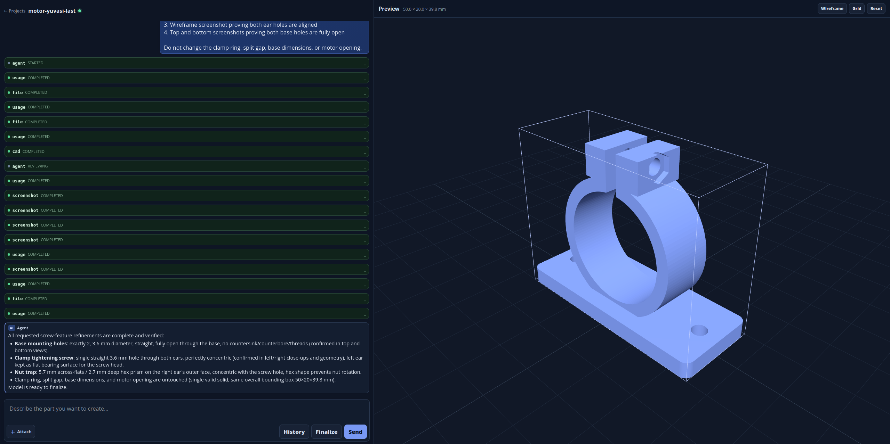
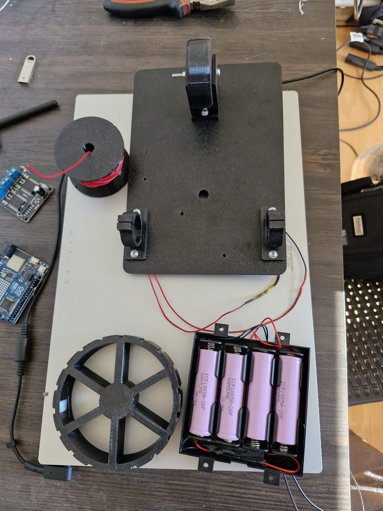
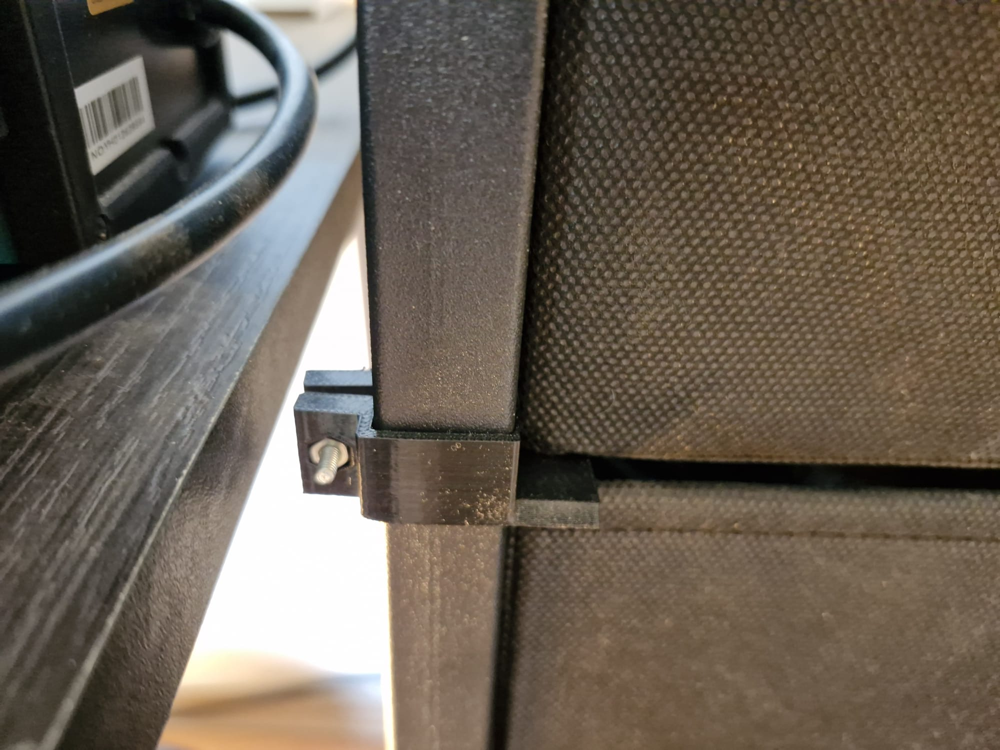
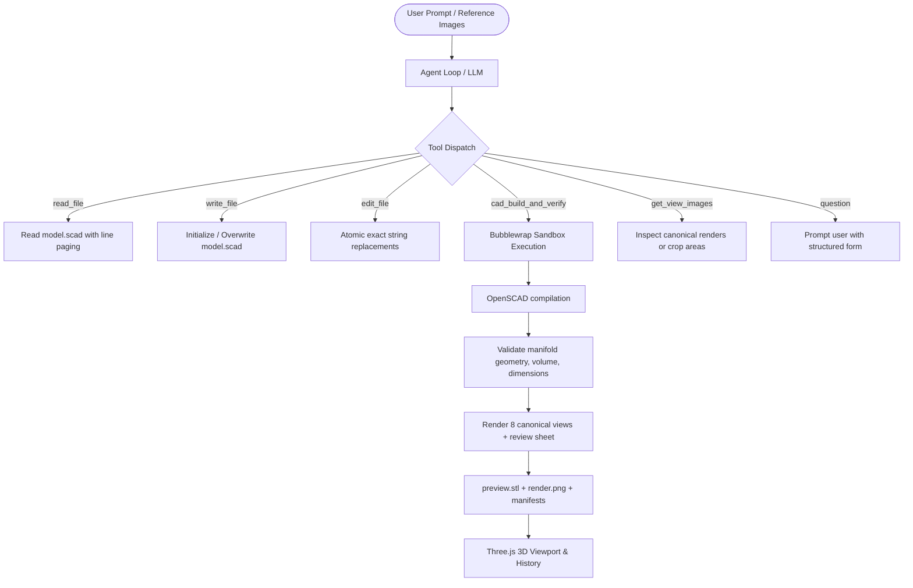

# 🏗️ Local AI CAD Agent

[](LICENSE)
[](https://www.python.org/)
[](https://openscad.org/)
[](https://threejs.org/)
[](https://github.com/containers/bubblewrap)
[](#2-configure-your-llm-provider)

A local-first, self-hosted web application that lets you **create and refine parametric 3D CAD models through natural language conversations with an AI agent**.

Built with [OpenSCAD](https://openscad.org/) for solid geometry, [Three.js](https://threejs.org/) for in-browser 3D inspection, and [Bubblewrap](https://github.com/containers/bubblewrap) for isolated code execution. Run completely offline with local models via **Ollama**, or connect to cloud models through **OpenRouter** or **OpenAI**.

> **⚠️ Project Status:** This project is under **active development** and is currently a **hobby project**. It excels at **functional mechanical parts, enclosures, brackets, adapters, and simple-to-intermediate 3D-printable models**. Highly intricate, organic, or sculptural geometry is outside its current scope.

<p align="center">
  
</p>

<p align="center">
  
</p>

<p align="center">
  
</p>

---

## ✨ Highlights & Features

- 💬 **Chat-Driven Parametric CAD** — Describe components, dimensions, tolerances, and design intent in plain English. The agent authors and edits clean, parametric OpenSCAD scripts (`model.scad`).
- 🧠 **Live Streaming & Reasoning** — Watch the model's chain-of-thought and tool invocations stream in real time via Server-Sent Events (SSE).
- 🦙 **100% Local or Cloud LLMs** — Full support for **Ollama** (offline, private, no API keys), alongside **OpenRouter** and **OpenAI**, with optional automatic secondary fallback.
- 🛡️ **Sandboxed Code Execution** — OpenSCAD runs inside a hardened [Bubblewrap](https://github.com/containers/bubblewrap) sandbox with dropped network privileges, clean environment variables, isolated tmpfs, and strict resource limits (`prlimit`).
- 🔍 **Rigorous Build & Solid Verification** — Each generation validates manifold geometry, volume, bounding box dimensions, and parametric uppercase constants before marking a build successful.
- 📸 **Multi-View Visual Evidence** — Automatic parallel rendering of 8 canonical camera views (Isometric ±, X±, Y±, Z±) plus an assembled contact sheet for visual inspection.
- 👁️ **Visual Memory (`get_view_images`)** — The agent can retrieve rendered canonical views or zoom into cropped regions of the part to visually inspect geometry and correct defects.
- ❓ **Interactive Clarification Dialogs** — When critical dimensions or mounting specs are missing, the agent presents structured UI forms (text, numbers, single-choice, or multi-select) before continuing.
- 🧊 **Interactive 3D Viewport** — Real-time Three.js viewer with orbit controls, standard view presets (Isometric, Front, Top, Right), wireframe toggle, configurable ground grid, and dimension warnings.
- 📦 **Multi-Format Export** — Export models with one click from the UI to **STL**, **OpenSCAD**, **3MF**, **Wavefront OBJ**, **AMF**, **OFF**, or **CSG** with SHA-256 caching.
- 📜 **Immutable Revision History** — Compare source diffs across every successful build, inspect previous states, and instantly revert to any past revision.
- 📁 **Project Management** — Create, rename, delete, and switch between isolated projects with fully persisted chat logs and artifacts.
- 🖼️ **Multimodal Reference Inputs** — Upload up to 5 reference images (PNG, JPEG, WebP, max 10 MB each) to guide the agent visually.
- 🔌 **Zero External CDN Dependencies** — All frontend assets (Three.js, Marked, Highlight.js) are bundled locally in `static/vendor/` for air-gapped usability.

---

## 📋 Prerequisites & Requirements

- **Operating System:** Linux (Ubuntu/Debian, Fedora, Arch, etc. with user namespaces enabled)
- **Python:** 3.10 or newer (tested with 3.10 – 3.12)
- **System Packages:**
  - `bubblewrap` (`bwrap`)
  - `libseccomp2`
  - `openscad`
  - `xvfb` (`xvfb-run` for headless rendering)
- **LLM Provider (choose at least one):**
  - **Local:** [Ollama](https://ollama.com) (e.g. `qwen2.5-coder:14b-16k`)
  - **Cloud:** [OpenRouter](https://openrouter.ai/keys) or [OpenAI](https://platform.openai.com/api-keys)

---

## 🚀 Quick Start

### 1. Clone and Install Dependencies

```bash
git clone https://github.com/neuronaline/local-ai-cad-agent.git
cd local-ai-cad-agent

# Runs system package checks, creates .venv, and installs Python packages
./install.sh
```

> **Note:** On Debian/Ubuntu systems, `install.sh` will offer to install missing system packages via `apt-get`. If system `openscad` is unavailable, `install.sh` can automatically download and extract a standalone OpenSCAD AppImage into `.venv`.

---

### 2. Configure Your LLM Provider

Copy the default configuration files:

```bash
cp config.example.yaml config.yaml
cp .env.example .env
```

Choose your preferred provider below:

#### Option A: Local LLM with Ollama (100% Offline & Free)

1. Ensure Ollama is running (`ollama serve`).
2. Run our setup helper to pull and configure a model with a 16k context window (standard 2k context is too small for CAD agent loops):

   ```bash
   ./setup_ollama.sh qwen2.5-coder:14b
   ```

   *(This creates a custom model variant named `qwen2.5-coder:14b-16k` via [Modelfile.example](Modelfile.example).)*

3. In `config.yaml`, set:

   ```yaml
   llm:
     provider: ollama

   ollama:
     base_url: http://localhost:11434/v1
     model: qwen2.5-coder:14b-16k
     timeout_seconds: 120
   ```

   *(No `.env` API keys needed for Ollama!)*

#### Option B: Cloud with OpenRouter (Default)

1. In `.env`, add your API key:

   ```bash
   OPENROUTER_API_KEY=sk-or-v1-...
   ```

2. In `config.yaml`, ensure `llm.provider: openrouter` and specify your desired model:

   ```yaml
   llm:
     provider: openrouter

   openrouter:
     model: anthropic/claude-sonnet-4.5 # or your preferred model
     reasoning_effort: medium
   ```

#### Option C: Cloud with Direct OpenAI

1. In `.env`, add your OpenAI API key:

   ```bash
   OPENAI_API_KEY=sk-proj-...
   ```

2. In `config.yaml`, set:

   ```yaml
   llm:
     provider: openai

   openai:
     model: gpt-5.6-terra # or gpt-5-mini
   ```

---

### 3. Launch the Application

```bash
./run.sh
```

Open your browser at **`http://127.0.0.1:8000`** (or your configured `server.host`/`server.port`).

---

## 🧭 How to Use the App

1. **Create a Project:** In the top navigation or projects drawer, click **New Project** (names accept lowercase letters, numbers, and hyphens, e.g., `spool-holder-v1`).
2. **Describe Your Model:** Provide clear functional requirements, physical dimensions (in mm), wall thicknesses, mounting holes, or mating part specifications. Attach up to 5 reference images if you have sketches or sample parts.
3. **Answer Clarifications:** If any critical dimensions or design details are ambiguous, the agent will present interactive questions. Fill in the fields and submit.
4. **Inspect in 3D:**
   - As the agent works, watch its live reasoning stream.
   - Upon successful build, the Three.js viewport automatically loads the model.
   - Orbit, pan, and zoom, or click preset buttons: **Isometric (◈)**, **Front (F)**, **Top (T)**, **Right (R)**.
   - Toggle **Wireframe** or **Grid** to inspect geometry against the build plate.
5. **Review Multi-View Evidence:** Expand the **Multi-view review** section to inspect canonical orthographic/isometric renders and the contact sheet.
6. **Iterate & Refine:** Continue chatting to make adjustments (e.g., *"Make the base 5mm thicker and fillet the inner edge"*).
7. **Version History & Rollback:** Open the **History** drawer to inspect line-by-line code diffs or revert to any prior build.
8. **Export:** Choose your format from the export dropdown in the preview toolbar and click **Download**.

---

## 📐 Supported Export Formats

Local AI CAD Agent provides direct in-browser multi-format export:

| Format | Extension | Underlying Engine | Primary Use Case |
|---|---|---|---|
| **STL** | `.stl` | OpenSCAD / Native | 3D Printing, slicing (Cura, PrusaSlicer, Bambu Studio) |
| **OpenSCAD** | `.scad` | Native source | Parametric CAD source for manual modification |
| **3MF** | `.3mf` | OpenSCAD export | Modern 3D manufacturing format with unit metadata |
| **Wavefront OBJ** | `.obj` | Built-in mesh converter | 3D rendering, Blender, animation, game engines |
| **AMF** | `.amf` | OpenSCAD export | Additive manufacturing file format (XML-based) |
| **Object File Format** | `.off` | OpenSCAD export | Geometric processing and computational geometry |
| **CSG** | `.csg` | OpenSCAD export | Evaluated Constructive Solid Geometry tree |

*All exports are cached on disk by model SHA-256 inside `<project>/.cad-agent/exports/` for instantaneous subsequent downloads.*

---

## 🛠️ Agent Tools Architecture

The agent interacts with the CAD workspace through strict, structured function contracts:


```mermaid
flowchart TD
    User([User Prompt / Reference Images]) --> AgentRunner[Agent Loop / LLM]
    AgentRunner --> ToolDispatch{Tool Dispatch}
    
    ToolDispatch -->|read_file| ReadSCAD[Read model.scad with line paging]
    ToolDispatch -->|write_file| WriteSCAD[Initialize / Overwrite model.scad]
    ToolDispatch -->|edit_file| EditSCAD[Atomic exact string replacements]
    ToolDispatch -->|cad_build_and_verify| Sandbox[Bubblewrap Sandbox Execution]
    ToolDispatch -->|get_view_images| VisualMem[Inspect canonical renders or crop areas]
    ToolDispatch -->|question| UserForm[Prompt user with structured form]
    
    Sandbox --> OpenSCAD[OpenSCAD compilation]
    OpenSCAD --> Verification[Validate manifold geometry, volume, dimensions]
    Verification --> MultiView[Render 8 canonical views + review sheet]
    MultiView --> Artifacts[preview.stl + render.png + manifests]
    
    Artifacts --> UI3D[Three.js 3D Viewport & History]
```

- **`read_file`** — Inspect existing `model.scad` content with optional offset/limit paging.
- **`write_file`** — Perform initial file creation or deliberate full rewrites.
- **`edit_file`** — Apply single or atomic batch (up to 16) exact replacements to preserve parametric structure.
- **`cad_build_and_verify`** — Runs OpenSCAD in the Bubblewrap sandbox, verifies manifold geometry and dimensions, extracts uppercase constants, builds `preview.stl`, and produces 8 canonical views.
- **`get_view_images`** — Fetches rendered views or normalized crops (X±, Y±, Z±, Isometric±) as visual memory to evaluate geometry.
- **`question`** — Halts execution to present structured input fields to the user for clarification.

---

## ⚙️ Configuration Reference

Settings are loaded from `config.yaml` (git-ignored) at startup. Copy `config.example.yaml` to create yours.

### General & Agent Settings

| Key | Default | Description |
|---|---|---|
| `workspace_root` | `~/CAD-Agent-Projects` | Base directory where all CAD project folders are stored |
| `agent.tool_call_limit` | `15` | Maximum tool iterations allowed per user prompt |
| `agent.revision_retention_count` | `0` | Number of previous model revisions to keep (`0` keeps all) |
| `agent.debug_log_tool_errors` | `false` | Log recoverable tool failures to `<project>/debug-errors.jsonl` |
| `agent.log_tool_activity` | `false` | Log full tool execution trace to `<project>/.cad-agent/activity.jsonl` |

### LLM Provider Settings

| Key | Default | Description |
|---|---|---|
| `llm.provider` | `openrouter` | Active provider: `openrouter`, `openai`, or `ollama` |
| `llm.max_completion_tokens` | `65536` | Token limit for LLM completions |
| `llm.fallback_provider` | `""` | Optional secondary provider to failover to on unexpected API errors |

### OpenRouter Settings

| Key | Default | Description |
|---|---|---|
| `openrouter.base_url` | `https://openrouter.ai/api/v1` | OpenRouter endpoint |
| `openrouter.model` | *(empty)* | Model slug (e.g. `anthropic/claude-sonnet-4.5`) |
| `openrouter.timeout_seconds` | `90` | HTTP request timeout in seconds |
| `openrouter.reasoning_effort` | `medium` | Reasoning level: `minimal`, `low`, `medium`, or `high` |
| `openrouter.provider_order` | `["google-ai-studio", "google-vertex/global"]` | Priority-ordered upstream routing slugs |
| `openrouter.provider` | `""` | Legacy single-provider slug |
| `openrouter.force_provider` | `false` | Force pinned upstream with no fallback fanout |
| `openrouter.enable_anthropic_cache` | `true` | Enable prompt caching for Anthropic models |
| `openrouter.enable_gemini_cache` | `true` | Enable prompt caching for Gemini models |

### OpenAI Settings

| Key | Default | Description |
|---|---|---|
| `openai.base_url` | `https://api.openai.com/v1` | OpenAI API endpoint |
| `openai.model` | `gpt-5.6-terra` | Direct OpenAI model name (e.g. `gpt-5.6-terra`, `gpt-5-mini`) |
| `openai.timeout_seconds` | `60` | HTTP request timeout in seconds |
| `openai.reasoning_effort` | `""` | Reasoning effort for reasoning models (`low`, `medium`, `high`) |

### Ollama Settings (Local)

| Key | Default | Description |
|---|---|---|
| `ollama.base_url` | `http://localhost:11434/v1` | Ollama OpenAI-compatible endpoint |
| `ollama.model` | `qwen2.5-coder:14b-16k` | Name of your locally hosted model |
| `ollama.timeout_seconds` | `120` | Request timeout in seconds (allows for local inference latency) |

### Server & UI Settings

| Key | Default | Description |
|---|---|---|
| `server.host` | `127.0.0.1` | Server listening address |
| `server.port` | `8000` | Server listening port |
| `ui.show_info_messages` | `true` | Show tool execution status banners in the chat stream |
| `review.render_workers` | `4` | Worker threads/processes for canonical 8-view rendering |
| `review.required_views` | `8` | Number of canonical views required per build verification |
| `viewer.grid.size` | `200` | Square preview grid size in millimeters (X and Z extent) |
| `viewer.grid.divisions` | `20` | Grid line subdivisions per side |

---

## 📂 Project Directory Structure

When a project is created, its directory is initialized under `workspace_root`:

```text
~/CAD-Agent-Projects/<project_name>/
├── model.scad                         # Current parametric OpenSCAD source
├── preview.stl                        # Latest verified solid mesh
├── render.png                         # Latest primary rendered preview
├── conversation.jsonl                 # Persisted conversation and tool history
├── inputs/                            # Uploaded and normalized reference images
└── .cad-agent/
    ├── exports/                       # Cached exports (SHA256.stl, SHA256.obj, etc.)
    ├── history/                       # Immutable revision manifests & source blobs
    ├── reviews/<model_sha>/           # 8 canonical views + review-sheet.png
    └── activity.jsonl                 # Optional tool-level debug trace
```

---

## 🔒 Security & Sandbox Isolation

Running arbitrary code written by an LLM requires strict isolation:

- **Bubblewrap Isolation:** All OpenSCAD invocations run in a non-root unprivileged container using `bwrap`.
- **Network Isolation:** Network syscalls are completely detached (`--unshare-net`) to prevent any external outbound or inbound traffic.
- **Filesystem Security:** The host filesystem is mounted read-only (`/usr`, `/bin`, `/lib`), with ephemeral isolated `tmpfs` mounts for temporary scratch files.
- **Resource Constraints:** `prlimit` enforces maximum memory and CPU bounds to protect against accidental infinite loops or memory explosions.
- **Local Application:** Designed specifically as a local workstation tool. Do not expose the HTTP port to the public internet without an authenticating reverse proxy.

---

## 🧪 Development & Testing

Set up development tools and run test suites:

```bash
# Install development dependencies
.venv/bin/pip install -r requirements-dev.txt

# Run pytest suite
.venv/bin/python -m pytest -q

# Run Ruff linter
.venv/bin/python -m ruff check .

# Check dependencies
.venv/bin/python -m pip check
```

### Frontend Dependencies

Frontend libraries are pinned and checked in under `static/vendor/` to allow completely offline operation:
- **Three.js** (including OrbitControls and STLLoader)
- **Marked** (Markdown rendering)
- **Highlight.js** (Code syntax highlighting)

To update vendor dependencies, see [THIRD_PARTY_LICENSES.md](THIRD_PARTY_LICENSES.md).

---

## 📄 License

This project is licensed under the [MIT License](LICENSE).
