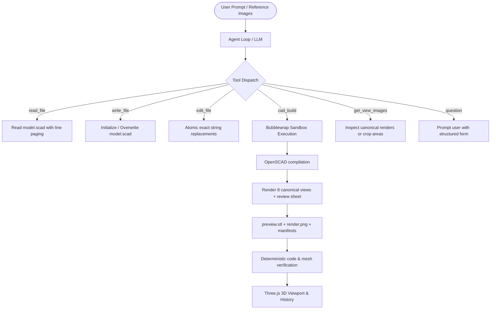

# 🏗️ Local AI CAD Agent

[](LICENSE)
[](https://www.python.org/)
[](https://github.com/neuronaline/local-ai-cad-agent/actions)

A local-first, self-hosted web application that lets you **create and refine parametric 3D CAD models through natural language conversations with an AI agent**.

Built with [OpenSCAD](https://openscad.org/) for solid geometry, [Three.js](https://threejs.org/) for in-browser 3D inspection, and [Bubblewrap](https://github.com/containers/bubblewrap) for isolated code execution. Run completely offline with local models via **Ollama** (once model weights are pulled, all generation runs with zero telemetry or network calls), or connect to cloud models through **OpenRouter** or **OpenAI**.

> **⚠️ Project Status:** This project is under **active development** and is currently a **hobby project**. It excels at **functional mechanical parts, enclosures, brackets, adapters, and simple-to-intermediate 3D-printable models**. Highly intricate, organic, or sculptural geometry is outside its current scope.

<p align="center">
  
</p>

<p align="center">
  
  
</p>

---

## 📑 Table of Contents

- [✨ Highlights & Features](#highlights-features)
- [📋 Prerequisites & Requirements](#prerequisites-requirements)
- [🚀 Quick Start](#quick-start)
- [🧭 How to Use the App](#how-to-use-the-app)
- [💡 Example Walkthrough](#example-walkthrough)
- [📐 Supported Export Formats](#supported-export-formats)
- [⚖️ Why a Dedicated Runtime?](#why-a-dedicated-runtime)
- [🛠️ Agent Tools Architecture](#agent-tools-architecture)
- [🔒 Security & Sandbox Isolation](#security-sandbox-isolation)
- [⚠️ Known Limitations](#known-limitations)
- [🔧 Troubleshooting](#troubleshooting)
- [⚙️ Configuration Reference](#configuration-reference)
- [📂 Project Directory Structure](#project-directory-structure)
- [🧪 Development & Testing](#development-testing)
- [🗺️ Roadmap](#roadmap)
- [🤝 Contributing & Community](#contributing-community)
- [📄 License](#license)

---

<a id="highlights-features"></a>
## ✨ Highlights & Features

- 💬 **Chat-Driven Parametric CAD** — Describe components, dimensions, tolerances, and design intent in plain English. The agent authors and edits clean, parametric OpenSCAD scripts (`model.scad`).
- 🧠 **Live Streaming & Reasoning** — Watch the model's chain-of-thought and tool invocations stream in real time via Server-Sent Events (SSE).
- 🦙 **Local & Cloud LLMs** — Full support for **Ollama** (offline, private, no API keys), alongside **OpenRouter** and **OpenAI**, with optional automatic secondary fallback.
- 🛡️ **Sandboxed Code Execution** — OpenSCAD runs inside an isolated [Bubblewrap](https://github.com/containers/bubblewrap) container with detached networking and read-only host mounts.
- 🔍 **Deterministic Build & Mesh Verification** — Automatically validates code syntax, manifold mesh topology, non-zero volume, bounds, and parametric conventions with categorized risk scoring on every build.
- 📸 **Multi-View Visual Inspection** — Parallel rendering of 8 canonical camera views plus an assembled contact sheet, allowing the agent to visually inspect geometry and correct defects (`get_view_images`).
- ❓ **Interactive Clarification Dialogs** — When critical dimensions are ambiguous, the agent presents structured UI forms (text, numbers, choices) before proceeding.
- 🧊 **Interactive 3D Viewport** — Real-time Three.js viewer with orbit controls, standard viewpoint presets (Isometric, Front, Top, Right), wireframe toggle, and build-plate grid warnings.
- 📦 **Multi-Format Export** — Instant export to **STL**, **OpenSCAD**, **3MF**, **OBJ**, **AMF**, **OFF**, or **CSG** with SHA-256 caching.
- 📜 **Immutable Revision History** — Compare source diffs across every successful build, inspect previous states, and revert with one click.
- 📁 **Project Management** — Create, rename, delete, and switch between isolated projects with fully persisted chat logs and artifacts.
- 🖼️ **Multimodal Reference Inputs** — Upload up to 5 reference images (PNG, JPEG, WebP) to visually guide the agent.
- 🔌 **Zero External CDN Dependencies** — All frontend assets are bundled locally in `static/vendor/` for air-gapped usability.

---

<a id="prerequisites-requirements"></a>
## 📋 Prerequisites & Requirements

> [!TIP]
> **Debian / Ubuntu users:** You do not need to install system packages manually. Running `./install.sh` in the Quick Start below will automatically detect missing dependencies, offer to install them via `apt-get`, and configure OpenSCAD.

<a id="platform-support"></a>
### Platform Support
- **Linux (Native):** Ubuntu/Debian, Fedora, Arch, and other distributions with unprivileged user namespaces enabled.
- **Windows:** Supported via **WSL2** (Windows Subsystem for Linux, Ubuntu 22.04+ recommended). Native Windows is unsupported because sandboxing requires Linux Bubblewrap.
- **macOS:** Native macOS is unsupported because sandboxing requires Linux kernel namespaces. Running inside a Linux virtual machine (e.g. Lima, OrbStack, or UTM) provides native namespace support. If running inside Docker on macOS, container execution requires elevated capabilities (`--cap-add=SYS_ADMIN` and an unconfined seccomp profile) to permit Bubblewrap user namespace creation.

### Requirements & System Packages
- **Python:** 3.10 or newer (tested with 3.10 – 3.12)
- **System Packages:**
  - `bubblewrap` (`bwrap`)
  - `libseccomp2`
  - `openscad` (2021.01 or newer)
  - `xvfb` (`xvfb-run` for headless multi-view rendering)
  - `libgl1-mesa-dri` (software OpenGL rasterizer / `llvmpipe` for zero-GPU headless rendering)
- **LLM Provider (choose at least one):**
  - **Local:** [Ollama](https://ollama.com) (e.g. `qwen2.5-coder:14b-16k`)
  - **Cloud:** [OpenRouter](https://openrouter.ai/keys) or [OpenAI](https://platform.openai.com/api-keys)

### 🖥️ Hardware Recommendations (for Local LLMs)

When running local models via Ollama:

| Setup | Recommended Specs | Inference Speed & Turn Latency |
|---|---|---|
| **GPU Accelerated** *(Recommended)* | NVIDIA GPU with ≥12–16 GB VRAM (e.g., RTX 3060 12GB, RTX 4060 Ti 16GB, RTX 3090/4090), or Apple Silicon Mac (VM) with ≥16 GB unified RAM | ~25–45 tokens/sec (~3–8 seconds per tool turn) |
| **CPU Only** | Modern 8+ core x86_64 CPU, minimum 24–32 GB system RAM (DDR4/DDR5) | ~3–8 tokens/sec (~20–45 seconds per tool turn) |
| **Disk Storage** | At least 12 GB free disk space (Q4_K_M quant model weights ~9 GB + dependencies) | — |

---

<a id="quick-start"></a>
## 🚀 Quick Start

### 1. Clone and Install Dependencies

```bash
git clone https://github.com/neuronaline/local-ai-cad-agent.git
cd local-ai-cad-agent

# Runs system package checks, creates .venv, and installs Python packages
./install.sh
```

> **Note:** On Debian/Ubuntu systems, `install.sh` will offer to install missing system packages via `apt-get`. If system `openscad` is unavailable, `install.sh` can automatically download and extract a standalone OpenSCAD AppImage into `.venv`.

---

### 2. Configure Your LLM Provider

Copy the default configuration files:

```bash
cp config.example.yaml config.yaml
cp .env.example .env
```

Choose your preferred provider below:

#### Option A: Local LLM with Ollama (Offline & Free)

1. Ensure Ollama is running (`ollama serve`).
2. Run our setup helper to pull and configure a model with a 16k context window (initial pull requires an internet connection; once downloaded, inference runs 100% offline):

   ```bash
   ./setup_ollama.sh qwen2.5-coder:14b
   ```

   *(This creates a custom model variant named `qwen2.5-coder:14b-16k` via [Modelfile.example](Modelfile.example).)*

3. In `config.yaml`, set:

   ```yaml
   llm:
     provider: ollama

   ollama:
     base_url: http://localhost:11434/v1
     model: qwen2.5-coder:14b-16k
     timeout_seconds: 120
   ```

   *(No `.env` API keys needed for Ollama!)*

#### Option B: Cloud with OpenRouter (Default)

1. In `.env`, add your API key:

   ```bash
   OPENROUTER_API_KEY=sk-or-v1-...
   ```

2. In `config.yaml`, ensure `llm.provider: openrouter` and specify your desired model:

   ```yaml
   llm:
     provider: openrouter

   openrouter:
     model: <provider>/<model-slug>
     reasoning_effort: medium
   ```

> [!IMPORTANT]
> **Replace placeholder before starting:** `<provider>/<model-slug>` is a placeholder. You must replace it with an active model ID from the [OpenRouter Models Catalog](https://openrouter.ai/models) before starting the server.

#### Option C: Cloud with Direct OpenAI

1. In `.env`, add your OpenAI API key:

   ```bash
   OPENAI_API_KEY=sk-proj-...
   ```

2. In `config.yaml`, set:

   ```yaml
   llm:
     provider: openai

   openai:
     model: <model-name>
   ```

> [!IMPORTANT]
> **Replace placeholder before starting:** `<model-name>` is a placeholder. You must replace it with a supported model name from the [OpenAI Models Documentation](https://platform.openai.com/docs/models) before starting the server.

---

### 3. Launch the Application

```bash
./run.sh
```

Open your browser at **`http://127.0.0.1:8000`** (or your configured `server.host`/`server.port`).

> 🔒 **Security Notice:** The application binds to `127.0.0.1` by default with no built-in authentication. See [Security & Sandbox Isolation](#security-sandbox-isolation) before exposing the server to external networks.

---

<a id="how-to-use-the-app"></a>
## 🧭 How to Use the App

1. **Create a Project:** In the top navigation or projects drawer, click **New Project** (names accept lowercase letters, numbers, and hyphens, e.g., `spool-holder-v1`).
2. **Describe Your Model:** Provide clear functional requirements, physical dimensions (in mm), wall thicknesses, mounting holes, or mating part specifications. Attach up to 5 reference images if you have sketches or sample parts.
3. **Answer Clarifications:** If any critical dimensions or design details are ambiguous, the agent will present interactive questions. Fill in the fields and submit.
4. **Inspect in 3D:**
   - As the agent works, watch its live reasoning stream.
   - Upon successful build, the Three.js viewport automatically loads the model.
   - Orbit, pan, and zoom, or click preset buttons: **Isometric (◈)**, **Front (F)**, **Top (T)**, **Right (R)**.
   - Toggle **Wireframe** or **Grid** to inspect geometry against the build plate.
5. **Review Multi-View Evidence:** Expand the **Multi-view review** section to inspect canonical orthographic/isometric renders and the contact sheet.
6. **Iterate & Refine:** Continue chatting to make adjustments (e.g., *"Make the base 5mm thicker and fillet the inner edge"*).
7. **Version History & Rollback:** Open the **History** drawer to inspect line-by-line code diffs or revert to any prior build.
8. **Export:** Choose your format from the export dropdown in the preview toolbar and click **Download**.

---

<a id="example-walkthrough"></a>
## 💡 Example Walkthrough: Motor Mount Clamp

To see how a part goes from a conversational prompt to a verified physical 3D print:

1. **User Prompt:**
   > *"Create a 3D-printable parametric clamp for a 28mm round DC motor.*  
   > *- Base: 50×20 mm mounting plate, 6 mm thick, with two 3.6 mm through-holes spaced 38 mm apart for M3 screws.*  
   > *- Clamp ring: 28 mm inner diameter, 4 mm wall thickness, 20 mm wide, with a 2 mm split gap at the top.*  
   > *- Clamping ears: Two vertical ears on top of the split gap with a 3.6 mm pass-through hole for an M3 bolt.*  
   > *- Nut trap: Right ear outer face has a 5.7 mm across-flats hex cutout, 2.7 mm deep, to capture an M3 hex nut."*

2. **Generated Parametric Source (`model.scad` excerpt):**
   ```openscad
   // Extracted Parametric Constants
   MOTOR_DIAMETER   = 28.0;
   RING_WALL        = 4.0;
   RING_WIDTH       = 20.0;
   SPLIT_GAP        = 2.0;
   BASE_WIDTH       = 50.0;
   BASE_DEPTH       = 20.0;
   BASE_HEIGHT      = 6.0;
   BASE_HOLE_DIA    = 3.6;
   BASE_HOLE_PITCH  = 38.0;
   EAR_SCREW_DIA    = 3.6;
   HEX_NUT_FLATS    = 5.7;
   HEX_NUT_DEPTH    = 2.7;

   difference() {
       union() {
           // Base mounting plate
           translate([-BASE_WIDTH/2, -BASE_DEPTH/2, 0])
               cube([BASE_WIDTH, BASE_DEPTH, BASE_HEIGHT]);
           // Outer clamp cylinder and ears
           ...
       }
       // Motor bore, split gap, base screw holes, and hex nut pocket
       ...
   }
   ```

3. **Verification & Physical Result:**
   The backend automatically verifies manifold integrity (1 discrete solid, non-zero volume) and renders 8 canonical viewpoints to inspect hole alignment. The final STL is 3D printed and installed directly into a mechanical assembly (shown in the header screenshots above: [UI Session Preview](screenshots/screenshot.png) and [Assembled Physical Print](screenshots/real-simple-example.jpeg)).

---

<a id="supported-export-formats"></a>
## 📐 Supported Export Formats

Local AI CAD Agent provides direct in-browser multi-format export:

| Format | Extension | Underlying Engine | Primary Use Case |
|---|---|---|---|
| **STL** | `.stl` | OpenSCAD / Native | 3D Printing, slicing (Cura, PrusaSlicer, Bambu Studio) |
| **OpenSCAD** | `.scad` | Native source | Parametric CAD source for manual modification |
| **3MF** | `.3mf` | OpenSCAD export | Modern 3D manufacturing format with unit metadata |
| **Wavefront OBJ** | `.obj` | Built-in mesh converter | 3D rendering, Blender, animation, game engines |
| **AMF** | `.amf` | OpenSCAD export | Additive manufacturing file format (XML-based) |
| **Object File Format** | `.off` | OpenSCAD export | Geometric processing and computational geometry |
| **CSG** | `.csg` | OpenSCAD export | Evaluated Constructive Solid Geometry tree |

*All exports are cached on disk by model SHA-256 inside `<project>/.cad-agent/exports/` for instantaneous subsequent downloads.*

---

<a id="why-a-dedicated-runtime"></a>
## ⚖️ Why a Dedicated Runtime? (vs. Generic Coding Agents)

A common question is: *“Why not simply ask a CLI coding agent (such as Claude Code or Cursor) to generate OpenSCAD scripts directly in a shell?”*

While frontier LLMs can generate raw OpenSCAD syntax, programmatic CAD behaves fundamentally differently from standard software development. In typical unassisted terminal setups without specialized CAD harnesses, several friction points emerge:

1. **Compiler Exit Status vs. Geometric Integrity:** OpenSCAD returns `exit code 0` even when generating invalid non-manifold geometry, zero-thickness walls, or self-intersecting meshes. A standard terminal loop cannot detect these defects without a dedicated geometric evaluation harness.
2. **Headless Display & Automated Rasterization:** In headless environments without an active X11/Wayland display server or dedicated GPU, agents attempting visual self-correction encounter missing display errors. In our internal development runs, unassisted terminal loops attempting to configure virtual framebuffers or parse raw vertex buffers regularly burned ~40,000–60,000 tokens per session (captured in telemetry logs under `.cad-agent/trajectories/`).  
   While headless rendering requires `xvfb-run` and software OpenGL rasterization (`osmesa` or `llvmpipe`), `local-ai-cad-agent` handles this entirely behind the scenes: `./install.sh` checks and installs these dependencies automatically, and the backend runtime manages the virtual framebuffer without requiring the LLM to write shell commands or troubleshoot display sockets in context.
3. **Turnkey Isolation:** `local-ai-cad-agent` isolates compilation inside Linux Bubblewrap (`bwrap`) containers with unprivileged user namespaces, detached networking, and syscall filtering out of the box, without requiring custom host environment setup.
4. **Enabling Local Offline Models:** By offloading geometric verification, canonical multi-view rendering, and file diffing to the deterministic Python backend, the cognitive burden on the LLM is reduced. This allows compact local models (such as Qwen 2.5 Coder 14B via Ollama) to produce functional 3D printable models offline.

> **Scope with Local Models (e.g. Qwen 2.5 Coder 14B via Ollama):**
> - **Well suited for:** Prismatic functional parts, mounting brackets, electronics enclosures, adapters, standoffs, and baseplates with 5–10 parametric dimensions.
> - **Challenging:** Highly intricate assemblies, complex organic curves, tight-tolerance interlocking snap fits, or deeply nested boolean subtractions (where frontier cloud models remain recommended).
> - **Testing & Version Note:** Tested with `qwen2.5-coder:14b` (Q4_K_M quant, tested on Ollama 0.5.x, October 2026). Larger models like `qwen2.5-coder:32b` offer improved spatial reasoning on hardware with ≥24 GB VRAM; smaller 7B variants can handle basic prismatic boxes and plates but frequently struggle with complex boolean cutouts.

### Architectural Comparison

| Capability | Generic CLI Agents (Typical Out-of-the-Box Setup) | `local-ai-cad-agent` |
| :--- | :--- | :--- |
| Geometric Verification | Compiler exit status only; requires external geometric test harnesses to detect non-manifold solids | Deterministic topology, volume, manifold, and discrete solid count validation |
| Visual Inspection | Manual setup required; ad-hoc headless inspection loops can incur high token overhead | Automated 8-view canonical contact sheet with targeted sub-region image crops |
| Execution Security | Standard host user permissions by default; sandboxing requires custom external configuration | Isolated Bubblewrap sandbox with dropped network privileges, read-only system mounts, and seccomp filtering |
| Offline / Local LLMs | High context overhead from environment troubleshooting often strains smaller models | Offloads spatial checks to Python runtime, enabling compact local models via Ollama |
| Workflow & History | Terminal text output and manual file tracking; requires external 3D viewer | Integrated Three.js 3D viewport, SSE streaming, line diffs, and revision rollbacks |

---

<a id="agent-tools-architecture"></a>
## 🛠️ Agent Tools Architecture

The agent interacts with the CAD workspace through strict, structured function contracts:


```mermaid
flowchart TD
    User([User Prompt / Reference Images]) --> AgentRunner[Agent Loop / LLM]
    AgentRunner --> ToolDispatch{Tool Dispatch}
    
    ToolDispatch -->|read_file| ReadSCAD[Read model.scad with line paging]
    ToolDispatch -->|write_file| WriteSCAD[Initialize / Overwrite model.scad]
    ToolDispatch -->|edit_file| EditSCAD[Atomic exact string replacements]
    ToolDispatch -->|cad_build| Sandbox[Bubblewrap Sandbox Execution]
    ToolDispatch -->|get_view_images| VisualMem[Inspect canonical renders or crop areas]
    ToolDispatch -->|question| UserForm[Prompt user with structured form]
    
    Sandbox --> OpenSCAD[OpenSCAD compilation]
    OpenSCAD --> MultiView[Render 8 canonical views + review sheet]
    MultiView --> Artifacts[preview.stl + render.png + manifests]
    
    Artifacts --> Verifier[Deterministic code & mesh verification]
    Verifier --> UI3D[Three.js 3D Viewport & History]
```

- **`read_file`** — Inspect existing `model.scad` content with optional offset/limit paging.
- **`write_file`** — Perform initial file creation or deliberate full rewrites.
- **`edit_file`** — Apply single or atomic batch (up to 16) exact replacements to preserve parametric structure.
- **`cad_build`** (legacy alias `cad_build_and_verify`) — Compiles `model.scad` in the Bubblewrap sandbox, produces 8 canonical views and the review contact sheet, and runs deterministic code and mesh verification (manifoldness, watertightness, volume, solid count, $fn/EPS rules, risk score).
- **`get_view_images`** — Fetches rendered canonical views, the 8-view contact sheet, or normalized crops as visual memory to evaluate geometry.
- **`question`** — Halts execution to present structured input fields to the user for clarification.

---

<a id="security-sandbox-isolation"></a>
## 🔒 Security & Sandbox Isolation

Executing LLM-generated code safely requires layered operating system defenses. `local-ai-cad-agent` isolates compilation processes and validates untrusted inputs:

### Linux Bubblewrap (`bwrap`) Architecture
- **Namespace Isolation:** OpenSCAD subprocesses run with detached network (`--unshare-net`), PID (`--unshare-pid`), IPC (`--unshare-ipc`), and UTS (`--unshare-uts`) namespaces.
- **Filesystem Hardening:** Host system directories (`/usr`, `/bin`, `/lib`, `/opt`) are mounted strictly read-only. Ephemeral scratch data is written to an isolated in-memory `tmpfs` (`/tmp`). The only writable disk area is the active project directory.
- **Seccomp BPF Filtering:** A custom BPF filter is compiled at startup via `libseccomp` and exported to the runner. The filter operates on a default-allow model while explicitly blocking dangerous process-inspection and container-escape syscalls (`EPERM`):
  `ptrace`, `process_vm_readv`, `process_vm_writev`, `mount`, `umount2`, `pivot_root`, `open_by_handle_at`, `bpf`, `perf_event_open`, and `uselib`.
- **Resource Constraints:** Linux `prlimit` bounds CPU time and virtual memory to prevent accidental infinite recursion or compilation out-of-memory denial-of-service.

> [!NOTE]
> **Defense-in-Depth:** Bubblewrap user namespaces and seccomp filters provide robust process and filesystem isolation against untrusted scripts and accidental modifications. However, they share the host Linux kernel and should be viewed as defense-in-depth, not a substitute for full hardware virtualization against kernel-level vulnerabilities.

### 🛡️ Threat Model & Trust Boundaries

| Vector | Ingestion / Processing Strategy | Mitigations & Design Controls |
|---|---|---|
| **User Reference Images** | Parsed via Pillow, validated strictly for PNG, JPEG, and WebP formats. | Mitigates decompression bomb and memory exhaustion risks via a 10 MB file ceiling and a 10-megapixel decoded buffer ceiling. Automatically downscaled to max 1600px and stripped of EXIF metadata. |
| **LLM Output (OpenSCAD scripts)** | Written to `model.scad` in the project folder and passed to OpenSCAD. | Sandboxed inside Bubblewrap with unshared network (`--unshare-net`), isolated PID/IPC/UTS namespaces, and blocked dangerous syscalls. Writable disk access is constrained strictly to the active project folder and ephemeral tmpfs. |
| **Provider Credentials** | Read from `.env` on startup by the Python backend. | Kept in backend process memory; never forwarded into the sandbox container environment or exposed in client API responses. |

> [!WARNING]
> **No Built-in Authentication:** The web UI and REST API have no built-in user authentication. The server is configured to bind to `127.0.0.1` by default. **Never bind `server.host` to `0.0.0.0` or expose port 8000 directly to the internet or untrusted local networks** without an authenticating reverse proxy (e.g., Caddy with basic auth, Nginx, or a secure VPN like Tailscale/WireGuard).

---

<a id="known-limitations"></a>
## ⚠️ Known Limitations

- **Platform & Kernel Constraints:** Sandboxing relies on Linux Bubblewrap (`bwrap`) and unprivileged user namespaces. Windows requires WSL2, and macOS requires a Linux VM or container with elevated privileges (see [Platform Support](#platform-support)).
- **Headless Display Dependency:** Canonical 8-view rendering in headless/CI environments requires `xvfb-run` and software OpenGL (`libgl1-mesa-dri`), which `./install.sh` configures automatically.
- **Constructive Solid Geometry (CSG) Scope:** OpenSCAD evaluates geometry via CSG booleans. The agent excels at functional, dimensionally-accurate mechanical parts (brackets, enclosures, adapters, mounts). It is not designed for organic sculpting, polygon-heavy artistic models, or freeform continuous-curvature surfaces.
- **Single-Body Solid Focus:** The automated verification harness currently evaluates a single unified manifold solid (`preview.stl`). Multi-part mechanical assemblies with kinematic linkages or separate bill-of-materials components are not yet tracked as discrete bodies.
- **Single-User Security Boundary:** The web UI and REST API have no built-in authentication or access control; external exposure requires a reverse proxy (see [Security & Sandbox Isolation](#security-sandbox-isolation)).

---

<a id="troubleshooting"></a>
## 🔧 Troubleshooting

### 1. `bwrap: No permissions to create new namespace` (Ubuntu 24.04+)
Ubuntu 24.04 and newer enable AppArmor restrictions on unprivileged user namespaces by default (`kernel.apparmor_restrict_unprivileged_userns=1`), which prevents Bubblewrap from running without elevated privileges.

**Resolution:**
```bash
# Temporarily enable unprivileged user namespaces:
sudo sysctl -w kernel.apparmor_restrict_unprivileged_userns=0

# To persist across system reboots:
echo "kernel.apparmor_restrict_unprivileged_userns=0" | sudo tee /etc/sysctl.d/60-apparmor-namespace.conf
sudo sysctl --system
```

### 2. Ollama Connection Refused (`http://localhost:11434`)
If the agent fails to reach Ollama during preflight checks or generation:
1. Ensure the Ollama daemon is running:
   ```bash
   ollama serve
   ```
2. Verify Ollama is responsive and list available models:
   ```bash
   curl http://localhost:11434/api/tags
   ```
3. If running Ollama on another host or container, ensure `ollama.base_url` in `config.yaml` points to the correct network address (and that `OLLAMA_HOST=0.0.0.0` is set on the daemon host).

### 3. Headless Display & Xvfb Errors (`xvfb-run: error: Xvfb failed to start`)
If 8-view canonical rendering fails in headless or SSH environments:
1. Ensure `xvfb` and Mesa drivers are installed:
   ```bash
   sudo apt-get install -y xvfb libgl1-mesa-dri
   ```
2. If an earlier session crashed or was interrupted, remove any stale display lock files:
   ```bash
   rm -f /tmp/.X99-lock /tmp/.X11-unix/X99
   ```

---

<a id="configuration-reference"></a>
## ⚙️ Configuration Reference

Settings are loaded from `config.yaml` (git-ignored) at startup. Copy `config.example.yaml` to create yours.

<details>
<summary><b>View Full Configuration Reference</b></summary>
<br>

### General & Agent Settings

| Key | Default | Description |
|---|---|---|
| `workspace_root` | `~/CAD-Agent-Projects` | Base directory where all CAD project folders are stored |
| `agent.tool_call_limit` | `15` | Maximum tool iterations allowed per user prompt |
| `agent.revision_retention_count` | `0` | Number of previous model revisions to keep (`0` keeps all) |
| `agent.debug_log_tool_errors` | `false` | Log recoverable tool failures to `<project>/debug-errors.jsonl` |
| `agent.log_mode` | `off` | Activity logging mode: `off`, `debug` (rolling `activity.jsonl`), or `dataset` (untrimmed `trajectories/<run_id>.jsonl`) |
| `agent.log_tool_activity` | `false` | Legacy boolean flag; alias for `agent.log_mode: debug` |

### LLM Provider Settings

| Key | Default | Description |
|---|---|---|
| `llm.provider` | `openrouter` | Active provider: `openrouter`, `openai`, or `ollama` |
| `llm.max_completion_tokens` | `65536` | Token limit for LLM completions |
| `llm.fallback_provider` | `""` | Optional secondary provider to failover to on unexpected API errors |

### OpenRouter Settings

| Key | Default | Description |
|---|---|---|
| `openrouter.base_url` | `https://openrouter.ai/api/v1` | OpenRouter endpoint |
| `openrouter.model` | *(empty)* | Model slug (e.g. `<provider>/<model-slug>`, see [OpenRouter Models](https://openrouter.ai/models)) |
| `openrouter.timeout_seconds` | `90` | HTTP request timeout in seconds |
| `openrouter.reasoning_effort` | `medium` | Reasoning level: `minimal`, `low`, `medium`, or `high` |
| `openrouter.provider_order` | `["google-ai-studio", "google-vertex/global"]` | Priority-ordered upstream routing slugs |
| `openrouter.provider` | `""` | Legacy single-provider slug |
| `openrouter.force_provider` | `false` | Force pinned upstream with no fallback fanout |
| `openrouter.enable_anthropic_cache` | `true` | Enable prompt caching for Anthropic models |
| `openrouter.enable_gemini_cache` | `true` | Enable prompt caching for Gemini models |

### OpenAI Settings

| Key | Default | Description |
|---|---|---|
| `openai.base_url` | `https://api.openai.com/v1` | OpenAI API endpoint |
| `openai.model` | *(empty)* | Direct OpenAI model identifier (e.g. `<model-name>`, see [OpenAI Models](https://platform.openai.com/docs/models)) |
| `openai.timeout_seconds` | `60` | HTTP request timeout in seconds |
| `openai.reasoning_effort` | `""` | Reasoning effort for reasoning models (`low`, `medium`, `high`) |

### Ollama Settings (Local)

| Key | Default | Description |
|---|---|---|
| `ollama.base_url` | `http://localhost:11434/v1` | Ollama OpenAI-compatible endpoint |
| `ollama.model` | `qwen2.5-coder:14b-16k` | Name of your locally hosted model |
| `ollama.timeout_seconds` | `120` | Request timeout in seconds (allows for local inference latency) |
| `ollama.reasoning_effort` | `""` | Reasoning effort for thinking models (`low`, `medium`, `high`, or empty) |

### Server & UI Settings

| Key | Default | Description |
|---|---|---|
| `server.host` | `127.0.0.1` | Server listening address |
| `server.port` | `8000` | Server listening port |
| `ui.show_info_messages` | `true` | Show tool execution status banners in the chat stream |
| `review.render_workers` | `4` | Worker threads/processes for canonical 8-view rendering |
| `review.required_views` | `8` | Number of canonical views required per build verification |
| `viewer.grid.size` | `200` | Square preview grid size in millimeters (X and Z extent) |
| `viewer.grid.divisions` | `20` | Grid line subdivisions per side |

</details>

---

<a id="project-directory-structure"></a>
## 📂 Project Directory Structure

When a project is created, its directory is initialized under `workspace_root`:

```text
~/CAD-Agent-Projects/<project_name>/
├── model.scad                         # Current parametric OpenSCAD source
├── preview.stl                        # Latest verified solid mesh
├── render.png                         # Latest primary rendered preview
├── conversation.jsonl                 # Persisted conversation and tool history
├── inputs/                            # Uploaded and normalized reference images
└── .cad-agent/
    ├── exports/                       # Cached exports (SHA256.stl, SHA256.obj, etc.)
    ├── history/                       # Immutable revision manifests & source blobs
    ├── reviews/<model_sha>/           # 8 canonical views + review-sheet.png
    ├── trajectories/                  # Optional untrimmed run traces (dataset mode)
    └── activity.jsonl                 # Optional tool-level debug trace
```

---

<a id="development-testing"></a>
## 🧪 Development & Testing

Set up development tools and run test suites:

```bash
# Install development dependencies
.venv/bin/pip install -r requirements-dev.txt

# Run pytest suite
.venv/bin/python -m pytest -q

# Run Ruff linter
.venv/bin/python -m ruff check .

# Check dependencies
.venv/bin/python -m pip check
```

### Frontend Dependencies

Frontend libraries are pinned and checked in under `static/vendor/` to allow completely offline operation:
- **Three.js** (including OrbitControls and STLLoader)
- **Marked** (Markdown rendering)
- **Highlight.js** (Code syntax highlighting)

To update vendor dependencies, see [THIRD_PARTY_LICENSES.md](THIRD_PARTY_LICENSES.md).

---

<a id="roadmap"></a>
## 🗺️ Roadmap

- [ ] **Multi-Body Assemblies:** Modeling discrete multi-component assemblies with bill-of-materials (BOM) tracking and exploded view layouts.
- [ ] **STEP / B-Rep Export Investigation:** Exploring pathways for ISO 10303 STEP solid exchange (e.g. FreeCAD headless / CadQuery bridge).
- [ ] **Parametric Hardware Library:** Standard metric fastener cutouts, ISO thread profiles, heat-set insert pockets, and ball bearing seats.
- [ ] **Slicing Toolpath Previews:** Lightweight in-browser G-code preview to inspect slicing orientation and overhang support before export.
- [ ] **Multi-Model Orchestration:** Agent routing strategies combining compact local models for syntax edits with reasoning cloud models for geometry synthesis.

---

<a id="contributing-community"></a>
## 🤝 Contributing & Community

Contributions, bug reports, and design discussions are welcome!

- **Reporting Issues:** Please include your Linux distribution / WSL2 version, OpenSCAD version (`openscad -v`), and relevant error traces from `<project>/.cad-agent/activity.jsonl` or `<project>/debug-errors.jsonl`.
- **Code Style & Linting:** Code formatting is enforced via [Ruff](https://astral.sh/ruff). Run `.venv/bin/python -m ruff format .` and `.venv/bin/python -m ruff check .` before submitting PRs.
- **Testing:** Add or update tests under `tests/` and run `.venv/bin/python -m pytest -q`.
- **Releases & Changelog:** See git commit tags and release notes for ongoing version history.

---

<a id="license"></a>
## 📄 License

This project is licensed under the [MIT License](LICENSE).

